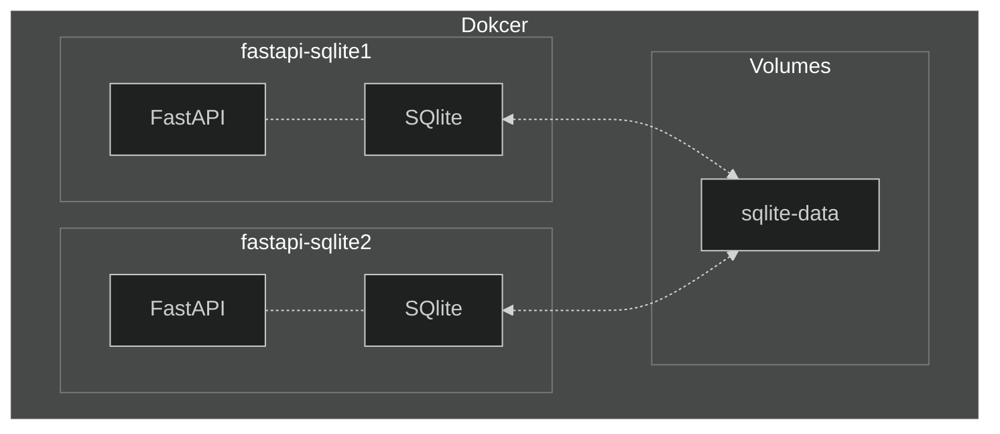

# FastAPI and SQlite
FastAPI SQlite 데이터 공유 테스트



### Docker Build

```bash
$ docker build -t fastapi-sqlite-app .
```

### Docker Volume

```bash
$ docker volume create sqlite-data
```

### Docker Run 
```bash
$ docker run -d --name fastapi-sqlite1 -v sqlite-data:/data -p 8000:8000 fastapi-sqlite-app
$ docker run -d --name fastapi-sqlite2 -v sqlite-data:/data -p 8001:8000 fastapi-sqlite-app
```

### Docker Compose Build

```bash
$ docker compose build
```

### Docker Compose Run

```bash
$ docker compose up -d
```